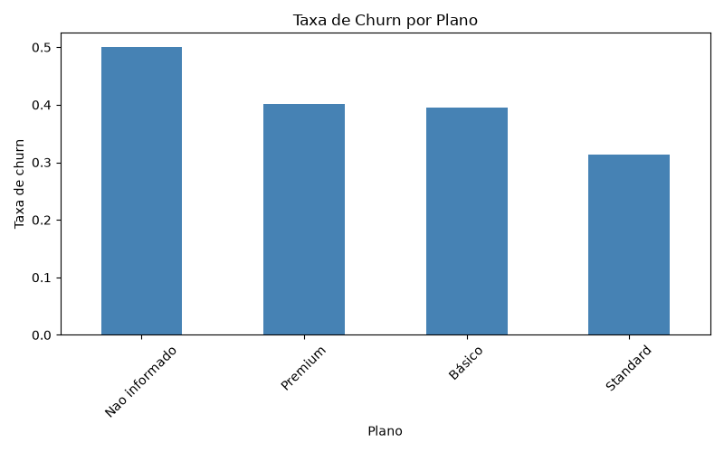
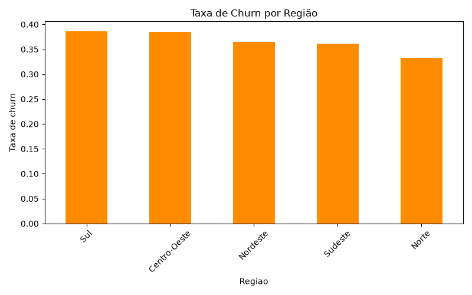
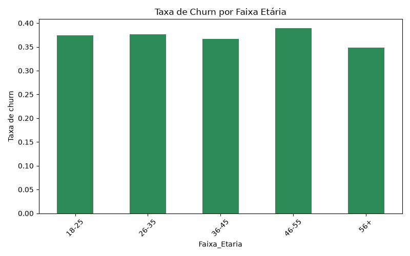
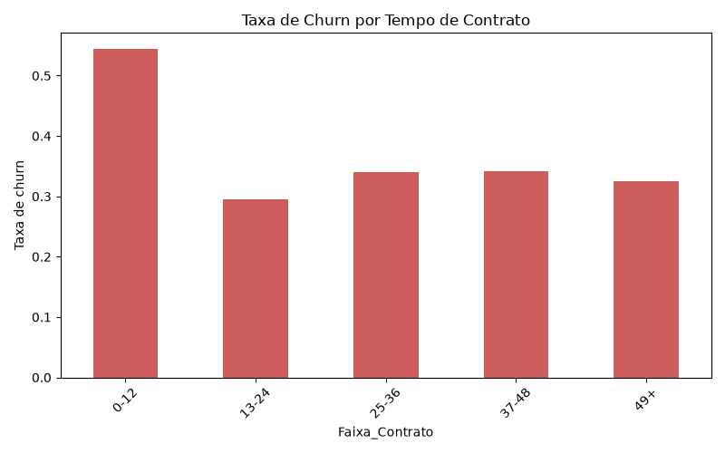

# Análise de Churn de Clientes

Projeto de análise exploratória de dados para entender o cancelamento (churn) de clientes, feito com Python e pandas. Objetivo: identificar quais fatores (plano, reclamações, tempo de contrato, idade, região) mais influenciam o cliente cancelar.

# Autor
- Vinicius Kozonoe Guaglini

## Ferramentas utilizadas

- Python 
- pandas
- matplotlib

## Estrutura do projeto

```
.
├── clientes_churn.csv              # dados brutos
├── analise_churn.py                # script principal da análise
├── clientes_churn_tratado.csv      # dados limpos, gerado pelo script
├── churn_por_plano.png             # gráfico gerado pelo script
├── churn_por_regiao.png            # gráfico gerado pelo script
├── churn_por_idade.png             # gráfico gerado pelo script
├── churn_por_contrato.png          # gráfico gerado pelo script
└── README.md
```

## Como executar

1. Clone o repositório
2. Instale as dependências:
```
pip install pandas matplotlib
```
3. Coloque o `clientes_churn.csv` na mesma pasta do script
4. Rode:
```
python analise_churn.py
```

O script imprime as taxas de churn no terminal, salva os gráficos em `.png` na mesma pasta e gera o `clientes_churn_tratado.csv` com os dados já limpos.

## Tratamento de dados

A base veio com problemas propositais:
- 5 registros duplicados → removidos
- 8 valores ausentes em `Plano` → preenchidos como "Nao informado"
- 10 valores ausentes em `Mensalidade` → preenchidos com a mediana de cada plano (não a mediana geral, já que os planos têm preços bem diferentes)

## Resultados

**Churn por plano**



**Churn por região**



**Churn por faixa etária**



**Churn por tempo de contrato**



## Principais insights

1. **Reclamações são o fator mais forte de churn** — clientes sem reclamações cancelam ~28% das vezes, enquanto quem tem 7+ reclamações cancela em até 90% dos casos
2. **Contratos recentes (até 12 meses) têm churn bem mais alto (~54%)** comparado a contratos mais antigos
3. **Plano Standard tem a menor taxa de churn** entre os planos, enquanto Básico e Premium ficam próximos e mais altos
4. Diferenças por região e faixa etária são discretas, sem um padrão forte — reforça que o cancelamento está mais ligado à experiência do cliente (reclamações, suporte) do que a características demográficas